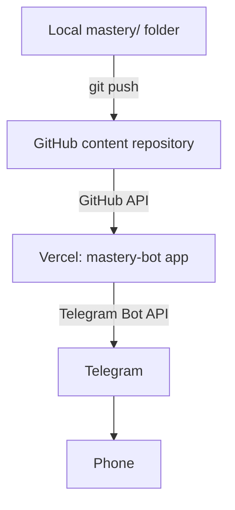

# Mastery Bot

Backend application for a private Telegram bot that lets me browse and read
a personal Markdown knowledge base from my phone.

This repository contains **application code only**. The knowledge base
content itself lives in a separate, independently versioned repository
(locally at `C:\Users\antonio\Desktop\mastery`). This app never copies that
content into itself — in production it is fetched from GitHub at request
time via the GitHub API, so pushing new Markdown files does not require a
new deployment of this app.

## Architecture



- **Telegram** — the UI. No business logic lives in Telegram itself.
- **Vercel (this repo)** — the application/backend. Stateless serverless
  functions; a Telegram webhook receives updates and responds.
- **GitHub** — the persistent source of truth for the Markdown content.
- **Local `mastery/` folder** — my editing workspace, pushed to GitHub when
  I want the bot to see changes.

The app is layered so Telegram code never talks to GitHub directly:

```
Telegram layer (handlers, keyboards, formatting)
        ↓
Application/service layer
        ↓
ContentProvider abstraction
        ↓
LocalFilesystemContentProvider | GitHubContentProvider
```

This project status: **Stage 1 complete** — Next.js/TypeScript scaffold,
tooling, and environment validation only. No Telegram or content-provider
logic yet.

## Local development

```bash
npm install
npm run dev
```

Copy `.env.example` to `.env.local` and fill in values as later stages
introduce the variables that consume them (`.env.local` is gitignored).

## Scripts

| Command                | Purpose                           |
| ---------------------- | --------------------------------- |
| `npm run dev`          | Start the Next.js dev server      |
| `npm run build`        | Production build                  |
| `npm run start`        | Start the production server       |
| `npm run lint`         | ESLint                            |
| `npm run typecheck`    | TypeScript, no emit               |
| `npm test`             | Run the Vitest suite once         |
| `npm run test:watch`   | Run Vitest in watch mode          |
| `npm run format`       | Format the codebase with Prettier |
| `npm run format:check` | Check formatting without writing  |

## Environment variables

See `.env.example` for the full list. Validated centrally in
`src/lib/env.ts` using Zod — `getEnv()` throws a descriptive error listing
every missing/invalid variable rather than failing on the first one.

| Variable                    | Required when                     | Notes                                                                   |
| --------------------------- | --------------------------------- | ----------------------------------------------------------------------- |
| `TELEGRAM_BOT_TOKEN`        | always                            | Never commit.                                                           |
| `TELEGRAM_WEBHOOK_SECRET`   | always                            | Verified against Telegram's secret-token header.                        |
| `ALLOWED_TELEGRAM_USER_IDS` | always                            | Comma-separated numeric Telegram user IDs.                              |
| `CONTENT_PROVIDER`          | always                            | `local` or `github`.                                                    |
| `CONTENT_ROOT`              | `CONTENT_PROVIDER=local`          | Absolute path to the knowledge base folder.                             |
| `GITHUB_OWNER`              | `CONTENT_PROVIDER=github`         | Repository owner/org.                                                   |
| `GITHUB_REPOSITORY`         | `CONTENT_PROVIDER=github`         | Repository name.                                                        |
| `GITHUB_BRANCH`             | optional                          | Defaults to `main`.                                                     |
| `GITHUB_CONTENT_PATH`       | `CONTENT_PROVIDER=github`         | Path inside the repo to the content root; empty string means repo root. |
| `GITHUB_TOKEN`              | private repos / higher rate limit | Read-only, server-side only.                                            |

## Project structure

```
src/
├── app/                # Next.js App Router (pages + future API routes)
├── lib/
│   └── env.ts           # Centralized, validated environment configuration
```

Future stages will add `src/content/`, `src/telegram/`, `src/auth/`,
`src/search/`, and `src/services/` as described in the project plan.

## Roadmap

1. ✅ Stage 1 — Next.js/TypeScript scaffold, tooling, env validation
2. Stage 2 — `ContentProvider` interface + `LocalFilesystemContentProvider`
3. Stage 3 — `GitHubContentProvider`
4. Stage 4 — Telegram bot: `/start`, navigation, authorization
5. Stage 5 — Markdown → Telegram formatting + safe message splitting
6. Stage 6 — `/search`
7. Stage 7 — Telegram webhook endpoint
8. Stage 8 — Protected webhook setup endpoint
9. Stage 9 — Vercel deployment
10. Stage 10 — End-to-end verification with a live webhook

## Security notes

- This is a private, single-user bot. Every webhook update is checked
  against `ALLOWED_TELEGRAM_USER_IDS` before any content operation.
- Webhook requests are validated against `TELEGRAM_WEBHOOK_SECRET`.
- GitHub access is read-only and server-side only; the token is never sent
  to Telegram or the client.
- User-supplied paths (via Telegram callback data) are never trusted
  directly — they are validated against the configured content root before
  use.
